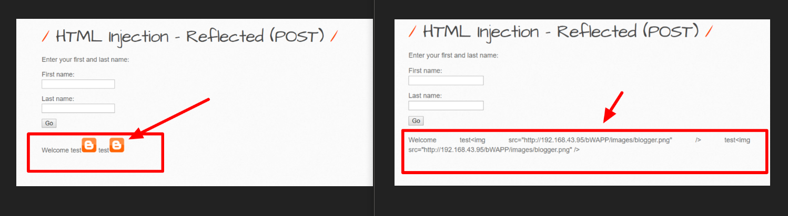

HTML Injection (POST)  
member :  
Ardnarong Boonkerd  
Suparath Suwannakorth  
Peranol Akkarasarateera  
-จาก URL : http://192.168.43.95/bWAPP/htmli_pose.php ด้วยทางกลุ่มได้ใช้ ripc หาไม่ได้ ทางกลุ่มจึงใช้วิธีอื่นในการค้นหาแทน 
  

    
  

-ทดสอบช่องโหว่ด้วยการ input html code
-test
-ลงทั้ง 2 ช่อง input
  

    
  

-จากนั้นระบบจะแสดงตามรูป  
 

    
  

-แสดงว่าสามารถทำ html injection ได้ทั้ง 2 input  
-วิธีการแก้ไข   
- download code ชื่อ htmli_post.php โดยใช้  winscp  login ด้วย user : bob/password : bob456  
 

    
  

-จากนั้นเปิดไฟล์ เพื่อแก้ไข code พบว่าไม่มีการ validation ตัวแปร firstname + lastname
 

    
  
  
-ทางทีมแก้ไขด้วย function htmlspecialchars  
 

    
  
 
-ในการแก้ไขสามารถใช้ function อื่น ได้แก่ strip_tags เป็นต้น  
-จากนั้นทำการ rename จาก htmli_post.php เป็น htmli_post_bob.php
-แล้วทำการ upload htmli_post_bob.php ขึ้น server

    
  
 
-จากนั้นลองเข้าไปทดสอบไฟล์ที่แก้ไขเสร็จแล้ว Url : http://192.168.43.95/bWAPP/htmli_pose_bob.php
-แล้วทำการ ทดสอบช่องโหว่ด้วยการ input html code test ลงทั้ง 2 ช่อง input

    
  

  

    
  

  

    
  

