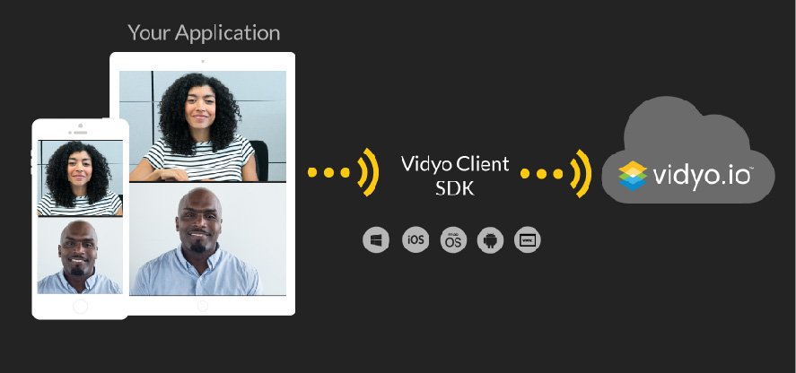
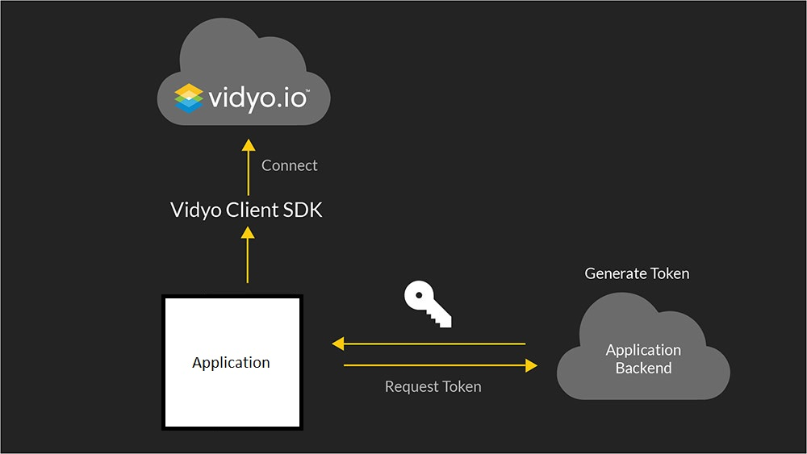

video call with token  

    
  

ที่ Vidyo เรามักจะได้รับคำถามเกี่ยวกับโทเค็นการทำความเข้าใจกับโทเค็นเป็นสิ่งที่สำคัญก่อนที่จะแก้ปัญหาหัวข้อขั้นสูงเพิ่มเติมใน vidyo.io โทเค็นจะใช้ในการตรวจสอบทางเดินหายใจ (มือถือเว็บหรือ แอพพลิเคชั่นแบบดั้งเดิม) ไปยังบริการ vidyo.io และวิดีโอ  
https://www.youtube.com/watch?time_continue=1&v=vWZd3tJSIHo  
โทเค็นคือเป็นข้อมูลรับรองระยะสั้นที่ส่งผ่านไปยังบริการ vidyo.io จากจุดสิ้นสุดในเวลาเชื่อมต่อ หากคำขอเชื่อมต่อมีโทเค็นที่ถูกต้องการโทรจะสำเร็จ หากโทเค็นไม่ถูกต้องการโทรจะถูกปฏิเสธ  
 

    
  

วิธีการรับโทเค็น  
โทเค็นถูกสร้างขึ้นโดยแอพพลิเคชั่นของคุณด้านหลังอีกนัยหนึ่งคุณให้โทเค็นที่ได้รับความสนใจเมื่อคุณโทรหาคุณในการโทรคุณไม่จำเป็นต้องทำ เรียก API ไปที่ vidyo.io เพื่อรับโทเค็น แต่คุณสร้างโทเค็นด้วยตัวเอง  
การสร้างโทเค็นอย่างไร  
โทเค็นถูกสร้างขึ้นโดยรวมชื่อผู้ใช้รหัสผ่านและเวลาที่ได้รับจากเหล่านั้นด้วยชื่อนักพัฒนาสตริงผลลัพธ์คือโทเค็น  

    
  

ภาษาที่สร้างโทเค็น
คุณสามารถดูโค้ดตัวอย่างโทเค็นได้จากเว็บไซต์ vidyo.io สำหรับ:  
Python  
Java  
Node.js  
C#  

โทเค็นไม่ซ้ำกันหรือไม่  
ควรจะสร้างรูปแบบการเคหะที่ไม่เหมือนกันสำหรับผู้ใช้งานหลาย ๆ คน แต่ก็ไม่สามารถทำได้เช่นกัน เมื่อจำเป็น  
วิธีปฏิบัติที่ดีที่สุดในการสร้างโทเค็นคืออะไร  
ในการสร้างโทเค็นคุณต้องมี ID แอพพลิเคชั่นและรหัสที่ได้รับการพัฒนาสิ่งเหล่านี้ควรได้รับการปกป้องในแอพพลิเคชั่นเคย์ของคุณไม่ได้สร้างโทเค็นในแอปพลิเคชั่น เนื่องจากอาจทำให้รหัสแอปพลิเคชันและรหัสนักพัฒนาซอฟต์แวร์รั่วไหล  
แนวทางปฏิบัติที่ดีที่สุดในที่สุดข้อตกลงที่เกี่ยวข้องกับการจับกุมผู้ก่อการร้ายและการให้เงินช่วยเหลือแก่ผู้ที่ถูกหลอกให้ใช้อย่างต่อเนื่อง ที่ผู้ใช้เชื่อมต่อที่เวลาเชื่อมต่อและรักษาระยะเวลาโทเค็นให้นานพอที่จะเชื่อมต่อได้  
 
ประโยชน์ของการพิสูจน์ตัวตนแบบใช้โทเค็น  
การพิสูจน์ตัวตนแบบโทเค็นนั้นปลอดภัยและเป็นอย่างมากที่นี่เป็นเพียงไม่กี่ประโยชน์ของการใช้งานได้รับการพิสูจน์ความถูกต้องตามโทเค็น  
-โทเค็นเป็นวิธีสำหรับคุณในการตรวจสอบสิทธิ์ผู้ใช้ของคุณด้วยบริการ vidyo.io โดยไม่เปิดเผยข้อมูลผู้ใช้เมื่อคุณได้รับอนุญาตให้ใช้งานได้แล้ว วิดีโอเมื่อใด  
-ที่ประเทศฟิลิปปินส์โทนีเค็นถูกสร้างขึ้นภายในแอพพลิเคชั่นของคุณไม่จำเป็นต้องค้นหาโทเค็น vidyo.io สำหรับโทเค็นสิ่งที่ช่วยในการปรับปรุงโดยลดเวลาในการเชื่อมต่อ  
-คุณไม่ได้เชื่อมโยงกับรูปแบบการตรวจสอบสิทธิ์ใด ๆ ที่จะใช้ vidyo.io สิ่งนี้จะช่วยให้คุณมีความทุกข์มากขึ้นในการตรวจสอบสิทธิ์ผู้ใช้แอปพลิเคชันของคุณ  
ที่มา https://vidyo.io/blog/how-to/using-token-authentication-embedded-video-conference-sessions/  
